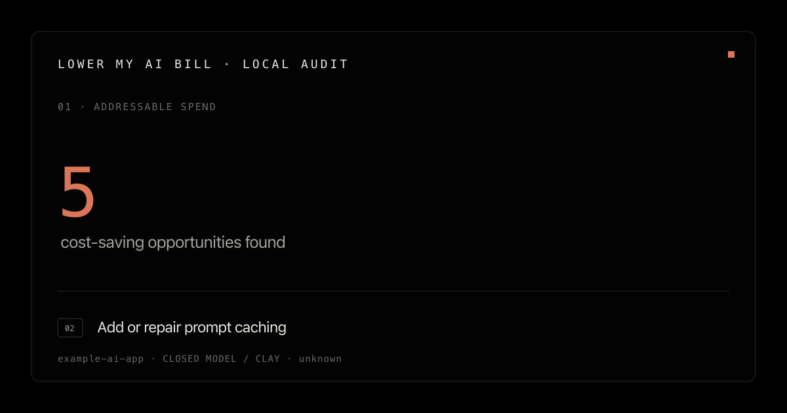
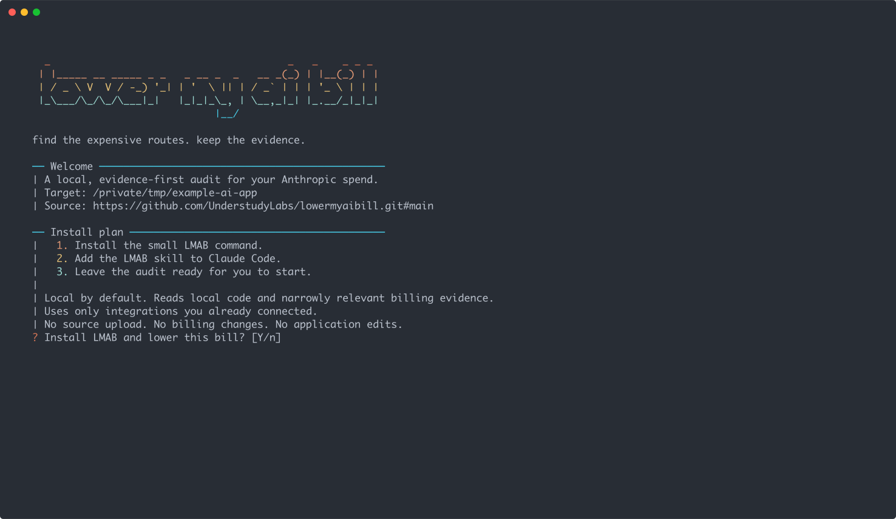
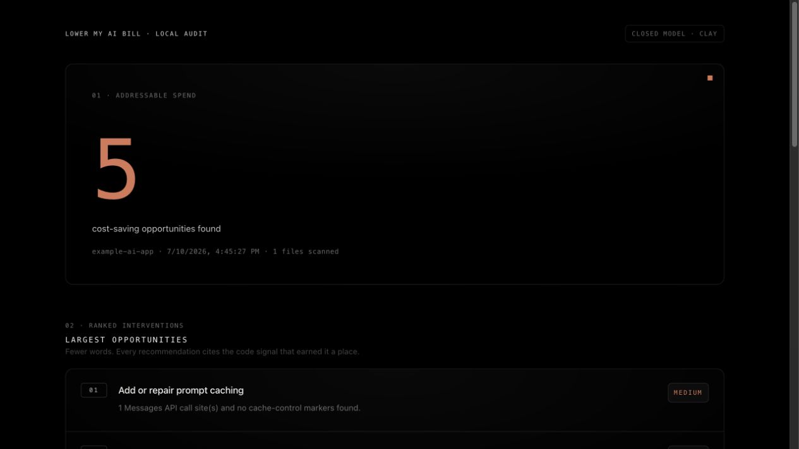

<p align="center">
  
</p>

<h1 align="center">Lower My AI Bill</h1>

<p align="center">
  Find the Claude routes costing you money. Get a local, evidence-backed report before changing production code.
</p>

<p align="center">
  <a href="LICENSE"></a>
  
  
</p>

## Run it

From the repository you want to audit:

```sh
curl -fsSL https://raw.githubusercontent.com/UnderstudyLabs/lowermyaibill/main/install.sh | bash
```

The installer adds the LMAB plugin for Claude Code and starts an audit in the current repository. The scan and report stay local under `.lmab/`.

<p align="center">
  
</p>

## What you get

| Code scan | Billing evidence | Local report |
| --- | --- | --- |
| Finds expensive model choices, oversized token and thinking budgets, missing cache markers, retry patterns, and batchable work. | Looks for Anthropic usage totals through integrations already connected to your coding agent. Access is narrow and read-only. | Ranks the strongest opportunities, records the evidence behind each claim, and creates a static share card. |

<p align="center">
  
</p>

## Evidence before promises

Code can show where to look. It cannot prove a savings percentage.

LMAB leaves the savings headline unquantified until it finds a usable billing baseline. Every finding shows its source, confidence, and claim boundary, so you can separate measured facts from estimates.

The audit does not upload source, edit application code, change billing, or require an Understudy account. Claude Code itself uses your existing Claude connection; LMAB does not ask for or bundle separate model credentials.

## Files it writes

| Artifact | Purpose |
| --- | --- |
| `.lmab/report.html` | Portable audit report you can open locally |
| `.lmab/evidence.json` | Normalized billing evidence and source ledger |
| `.lmab/scan.json` | Deterministic code-scan findings |
| `.lmab/share-card.svg` | Static card for sharing the result |

`.lmab/` is ignored by the installer so audit artifacts do not land in commits by accident.

## Help us test it

We are looking for a small first group of teams with real Anthropic usage. Run LMAB on one repository, inspect the report, and [tell us what was useful, wrong, or confusing](https://github.com/UnderstudyLabs/lowermyaibill/issues/new?template=audit-feedback.yml&title=Audit%20feedback%3A%20).

Do not attach source code, prompts, traces, invoices, account identifiers, or the generated `.lmab/` directory to a public issue. A description of the finding is enough.

## Uninstall

```sh
curl -fsSL https://raw.githubusercontent.com/UnderstudyLabs/lowermyaibill/main/install.sh | bash -s -- --uninstall
```

<details>
<summary>Local development</summary>

```sh
node bin/lmab audit /path/to/repo
npm test
claude plugin validate .
```

</details>

MIT licensed. Anthropic and Claude are trademarks of their respective owners. This independent project is not affiliated with or endorsed by Anthropic.
